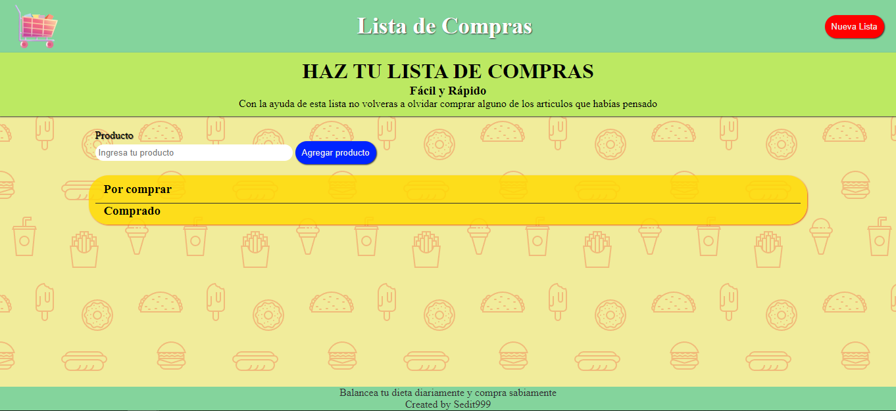

# Lista de Compras

Esta lista de compras es un proyecto CRUD el cual te permite agregar datos (articulos que se van a comprar) los cuales puedes borrar, editar si lo deseas y se agregra una opción la cual te permite marcar tu articulo como comprado, lo cual mandará dicho articulo a un segunda lista para que puedas diferenciar con facilidad qué articulos ya llevas y cuales te faltan.

De igual forma se tiene la opción de: "Nueva lista". Esto borrará toda nuestra lista actual y preparará todo para empezar una lista nueva (sólo se puede tener una lista a la vez).